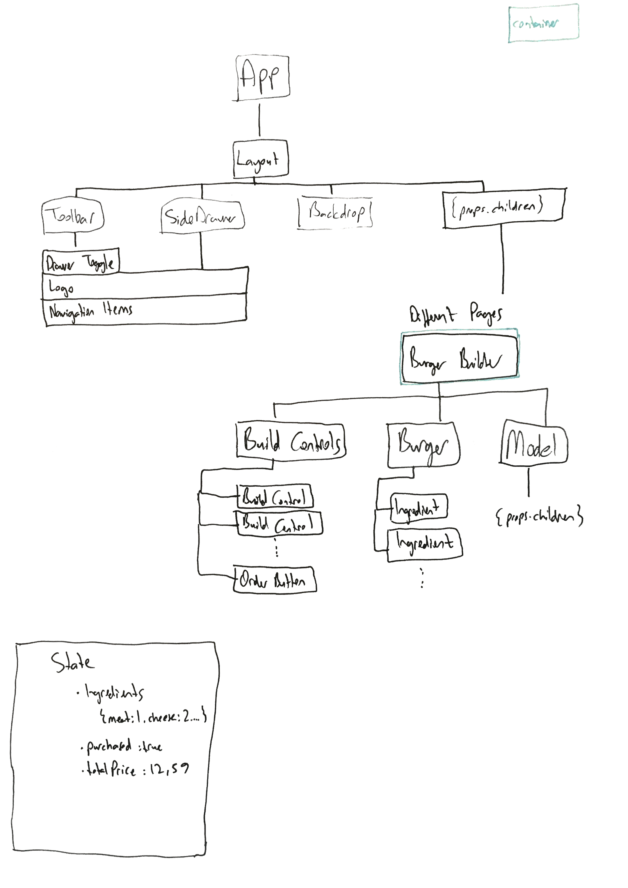

# BurgerBuilder

## 1. Overview
This is a Burger Builder application where you can visually add ingredients, and see the price of the current burger setup. This solution was produced for a Udemy React course, taught by Maximillian Schwarzmüller. 

### 1.1 Stack
This project is web based, and uses JavaScript. All user interfaces are made with React.js

## 2. Installation
You can download this repository, and run it with development server which is provided by Create-React-App

### 2.1 Installing Node and NPM
You need to have Node.js NPM package manager to install and run this application.
* [Download Node.js](https://nodejs.org/en/download/)

### 2.2. Starting Application
In your terminal, go to your project root folder, 
`npm install; npm run start`

## 3. Basic Component Tree
Basic component tree before implementation:
  

## 4. Sprints

Code implementation order:

1.Create React project with static solution and basic layout.

2.Implement all functionality to React project.

3.Write unit tests for functionality.

4.Make styles better.